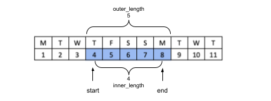

# php-just-date

PHP library for dealing with dates without any time information, and times without any date information

There are several excellent PHP libraries for working with DateTime objects. But sometimes you need to deal with only the date part, or only the time part of a DateTime object.

For example, a hotel booking system might care only about a guest's check-in date - and the exact time of arrival is unimportant. In those situations, all of the functionality relevant to the time of day just gets in the way, making things like comparisons and equality checks awkward. Added complications like timezones and daylight saving time further muddy the waters.

This library aims to make it simple to work with just the date part, or just the time part.

## Install

```
composer require madison-solutions/just-date
```

## JustDate

Represents a single date with no time information

### Basic Use

```php
use MadisonSolutions\JustDate\JustDate;

$date = JustDate::make(2019, 4, 21);

(string) $date;
// 2019-04-21

$date->format('D F jS Y');
// Sun April 21st 2019

$date->year;
// 2019
$date->month;
// 4
$date->day;
// 21
$date->day_of_week;
// 0

$date2 = JustDate::fromYmd('2019-04-22');
$date->isBefore($date2);
// true

```

### Time is ignored

```php
use MadisonSolutions\JustDate\JustDate;

$t1 = new DateTime('2019-04-21 16:23:12', new DateTimeZone('Australia/Sydney'));
$t1->format('r');
// Sun, 21 Apr 2019 16:23:12 +1000

$d1 - JustDate::fromDateTime($t1);
$d1->format('r');
// Wed, 24 Apr 2019 00:00:00 +0000

// Different time, different timezone, but the date part is the same
$t2 = new DateTime('2019-04-21 19:05:47', new DateTimeZone('Europe/London'));
$d2 = JustDate::fromDateTime($t2);
$d1->isSameAs($d2);
// true
```

### Today's date

```php
use MadisonSolutions\JustDate\JustDate;

// The current date, in the local timezone
$today = JustDate::today();

// What date is is right now in Denver?
$today_in_denver = JustDate::today(new DateTimeZone('America/Denver'));
```

### Traversing the calendar

```php
use MadisonSolutions\JustDate\JustDate;

$d1 = JustDate::make(2019, 04, 21);

$d2 = $d1->nextDay();
(string) $d2;
// 2019-04-22

```

Note JustDate objects are **immutable** - `nextDay()` and all other similar methods return new instances of JustDate!

```php
(string) $d1->prevDay();
// 2019-04-20
(string) $d1->addDays(3);
// 2019-04-24

(string) $d1->startOfMonth();
// 2019-04-01
(string) $d1->endOfMonth();
// 2019-04-30

// What day was it on this day 2 years ago?
JustDate::make($d1->year - 2, $d1->month, $d1->day)->format('l');
// Friday

// Find the previous Wednesday
$date = $d1;
while ($date->day_of_week != 3) {
    $date = $date->prevDay();
}
$date->format('D F jS Y');
// Wed April 17th 2019

// How many days is it until the start of the next month?
JustDate::spanDays($d1, $d1->endOfMonth()->nextDay())
// 10
```

### Working days

```php
// Add a certain number of 'working' days
$holidays = new DateSet(...[
    JustDate::make(2023, 12, 25), // Christmas
    JustDate::make(2023, 12, 26), // Boxing Day
    JustDate::make(2024, 1, 1), // New Year's Day
]);
$order_date = JustDate::make(2023, 12, 28);
// Delivery in 3 working days
// 29th Dec is Friday (a working day), 30 & 31 are weekend, 1st is holiday, 2nd and 3rd are next 2 working days
$delivery_date = $order_date->addWorkingDays(3, $holidays);
// Wed 3rd Jan 2024
```

## DateRange

Represents a range of dates between some start date and some end date (with no time information).

```php
use MadisonSolutions\JustDate\DateRange;
use MadisonSolutions\JustDate\JustDate;

$start = JustDate::make(2019, 04, 21);
$end = $d1->addDays(4);

$range = DateRange::make($start, $end);
(string) $range;
// 2019-04-21 to 2019-04-25

(string) $range->start;
// 2019-04-21
(string) $range->end;
// 2019-04-25

$range->includes(JustDate::make(2019, 04, 22));
// true

// alternatively create from strings
$range = DateRange::fromYmd('2019-04-21', '2019-04-25');
```

Note you can't create a range where `$start` is after `$end`

```php
$illegal_range = DateRange::make(JustDate::fromYmd('2019-04-22'), JustDate::fromYmd('2019-04-20'));
// Throws an \InvalidArgumentException
```

If you're not sure which of your 2 dates comes first, you can use `eitherWayRound()`.

```php
$range = DateRange::eitherWayRound(JustDate::fromYmd('2019-04-22'), JustDate::fromYmd('2019-04-20'));
$range->start; // 2019-04-20
$range->end; // 2019-04-22
```

### Intersection of 2 ranges

```php
$range2 = DateRange::fromYmd('2019-04-18', '2019-04-23');
(string) DateRange::intersection($range, $range2);
// 2019-04-21 to 2019-04-23

$range3 = DateRange::fromYmd('2019-04-18', '2019-04-19');
DateRange::intersection($range, $range3);
// null - they don't intersect
```

### Iterating over a range

```php
foreach ($range->each() as $date) {
    echo $date->format('d') . ",";
}
// 21,22,23,24,25,

foreach ($range->each(backwards: true) as $date) {
    echo $date->format('d') . ",";
}
// 25,24,23,22,21,

```

### Length of a DateRange

Whenever you talk about the 'length' of a date range, there's an ambiguity about what this means.

For example, if you have a DateRange where `$start` is Tuesday 4th, and `$end` is Monday 8th, as per the diagram below, then what should the 'length' of the range be?



There are 2 fairly reasonable, but different definitions.

You could count the number of days that are included in the range (inclusive of start and end dates).  In the example above the answer would be 5.  This could also be thought of as the length in days, measured from the first second of the start date to the last second of the end date.  By this definition, the smallest possible DateRange, where start and end are the same day, would have length 1.

Alternatively you could define the length by subtracting the start date from the end date.  In the example above, the answer would be 8 - 4 = 4.  This could also be thought of as the length in days, measured from the middle of the start date to the middle of the end date, or as the number of nights that occur between the start and end date.  By this definition, the smallest possible DateRange, where start and end are the same day, would have length 0.

The DateRange class provides both options - the first is accessed as `$range->outer_length` and the second is accessed as `$range->inner_length`.

```php
$range = DateRange::fromYmd('2019-04-04', '2019-04-08');
$range->inner_length; // 4
$range->outer_length; // 5
```

## JustTime

Represents a time without any date information.


```php
use MadisonSolutions\JustDate\JustTime;

$time = JustTime::make(17, 45, 30);

(string) $time;
// 17:45:30

$time->format('g:ia');
// 5:45pm

$time->hours;
// 17
$time->minutes;
// 45
$time->seconds;
// 30
$time->since_midnight;
// 63930

$time2 = JustTime::fromHis('17:55:00');
$time->isBefore($time2);
// true

$time3 = JustTime::fromSecondsSinceMidnight(125);
// 00:02:05

```

### Date info is ignored

The date part is removed, as well as the timezone.
If date parameters are used in a format string, the date will be 1 Jan 1970 (unix epoch).

```php
use MadisonSolutions\JustDate\JustTime;

$t1 = new DateTime('2019-04-21 16:23:12', new DateTimeZone('Australia/Sydney'));
$t1->format('r');
// Sun, 21 Apr 2019 16:23:12 +1000

$time1 - JustTime::fromDateTime($t1);
$time1->format('r');
// Thu, 01 Jan 1970 16:23:12 +0000

// Different date, different timezone, but the time part is the same
$t2 = new DateTime('2018-10-06 16:23:12', new DateTimeZone('Europe/London'));
$time2 = JustTime::fromDateTime($t2);
$time1->isSameAs($time2);
// true
```

### The time now

```php
use MadisonSolutions\JustDate\JustTime;

// The current time, in the local timezone
$now = JustTime::now();

// What time is is right now in Denver?
$time_now_in_denver = JustTime::now(new DateTimeZone('America/Denver'));
```

### Traversing the clock

Note JustTime objects are **immutable** - `addTime()` returns new instances of JustTime!

```php
use MadisonSolutions\JustDate\JustTime;

$t1 = JustTime::make(12, 0, 0);

$t2 = $t1->addTime(2, 30, 10);
(string) $t2;
// '14:30:10'

$t3 = $t1->addTime(14, 0, 0);
(string) $t3;
// '02:00:00'

$t4 = $t1->addTime(0, 0, -1);
(string) $t4;
// '11:59:59'

```

### Rounding to a certain interval

```PHP
use MadisonSolutions\JustDate\JustTime;

$t1 = JustTime::make(12, 47, 10);

// round to nearest minute
$t2 = $t1->round(60);
// 12:47:00

// round to nearest quarter of an hour
$t3 = $t1->round(15 * 60);
// 12:45:00
```

## DateSet and MutableDateSet

Represent a set of dates (not necessarily a continuous range).  MutableDateSet can have dates added or removed, DateSet cannot be changed after it is created.

```php
use MadisonSolutions\JustDate\DateSet;
use MadisonSolutions\JustDate\MutuableDateSet;

// Create a DateSet from any number of JustDate or DateRange objects (or other DateSet objects)
$set = new DateSet(JustDate::fromYmd('2023-11-17'), DateRange::fromYmd('2023-10-01', '2023-10-10'), JustDate::fromYmd('2023-10-05'));

// Dates in the sets are automatically de-duplicated and sorted
(string) $set; // '2023-10-01 to 2023-10-10, 2023-11-17'

$set->includes('2023-10-11'); // false

$mset = new MutableDateSet();
$mset->isEmpty(); // true
$mset->add(JustDate::fromYmd('2023-11-17'));
(string) $mset; // '2023-11-17'
$mset->add(DateRange::fromYmd('2023-10-01', '2023-10-10'));
(string) $mset; // '2023-10-01 to 2023-10-10, 2023-11-17'
```

### Combining DateSets

```php
$a = new DateSet(DateRange::fromYmd('2023-11-05', '2023-11-09'));
$b = new DateSet(DateRange::fromYmd('2023-11-08', '2023-11-12'));
DateSet::union($a, $b); // 2023-11-05 to 2023-11-12
DateSet::intersection($a, $b); // 2023-11-08 to 2023-11-09
$a->subtract($b); // 2023-11-05 to 2023-11-07
$b->subtract($a); // 2023-11-10 to 2023-11-12
```

### Iterating over a DateSet

You can choose to iterate over the continuous ranges in the set, or over the individual dates.

```php
$set = new DateSet(JustDate::fromYmd('2023-10-17'), DateRange::fromYmd('2023-10-20', '2023-10-25'));

foreach ($range->eachRange() as $range) {
    echo $range->start->format('d') . '-' . $range->end->format('d') . ", ";
}
// 17-17, 20-25, 

foreach ($range->eachDate() as $date) {
    echo $date->format('d') . ",";
}
// 17,20,21,22,23,24,25,
```

